# Ecommerce ADA para RHIE Accesorios

Es aplicación ecommerce construida con React. Esta herramienta te permitirá compras accesorios de moda y registrarte como usuario para poder realizar pagos. 

## 🚀 Características
 - Compra de productos.
 - Contador de stock.
 - Iniciar sesión, registrarte o mirar la pagina como invitado.
 - Realizar consultas enviando un mensaje a traves de la seccion "NOSOTROS".
 - Interfaz intuitiva y fácil de usar.

## Iniciar sesión - Registrarse - Ingresar como invitado: 

- Al iniciar sesión, primero aparece la opción de ingresar con una cuenta ya registrada. 

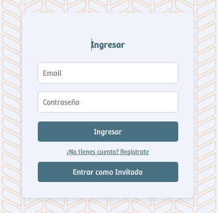

- Si no se posee cuenta, se puede realizar el registro. 

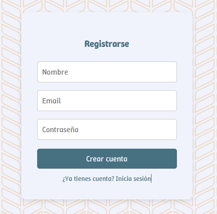

- Si no se desea registrar ninunga cuenta, se puede entrar como invitado. Hay que tener en cuenta que esta opción no me va a permitir realizar compras, ya que al seleccionar el carrito, redirije a la pagina de registro/inicio de sesión. 

## Vista desde el celular

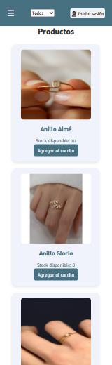

- Menú 

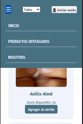

## Vista desde la tablet

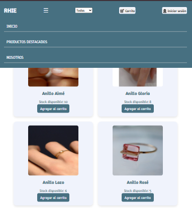

## Página principal del ecommerce

- Al ingresar a la página, se puede ver los productos. 

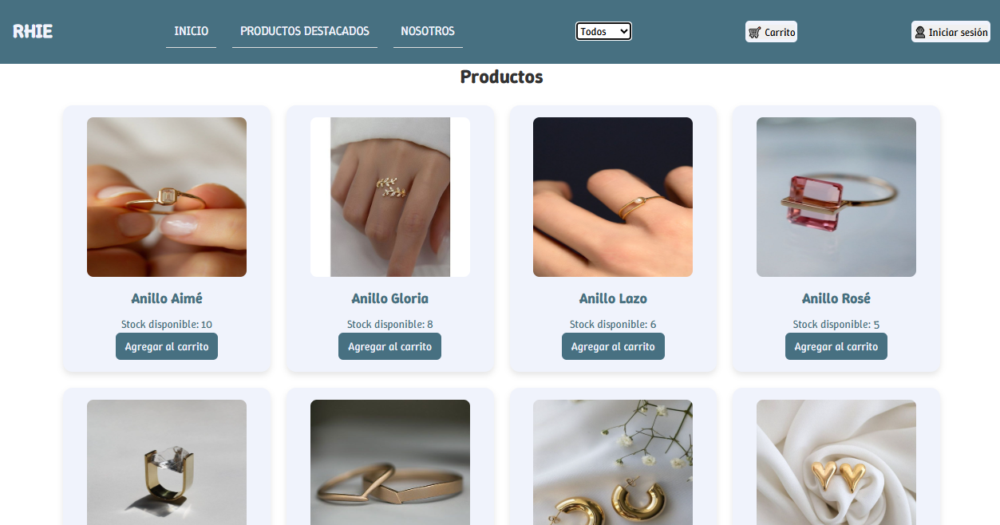

## Productos destacados

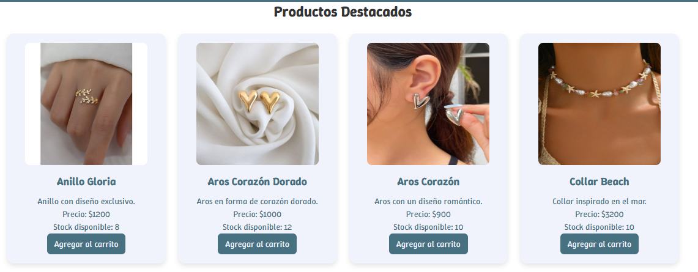

## Nosotros

- Para entrar en contacto con personal del negocio, se puede enviar un mensaje desde la sección nosotros. 

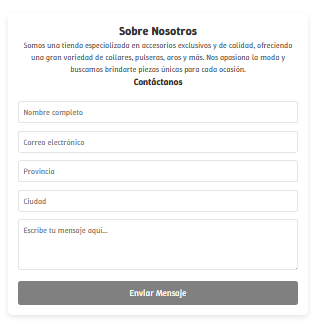

## Carrito 

- Una vez que entremos al carrito para pagar, podemos quitar productos, todos del mismo producto o una sola unidad. 

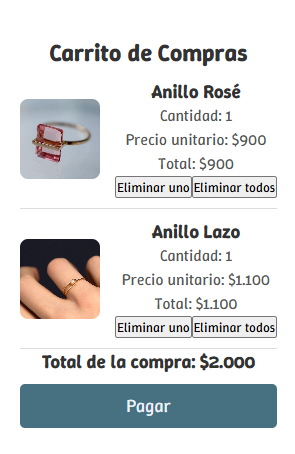

## Proceso de compra 

- Para realizar la compra se debe completar este formulario. 

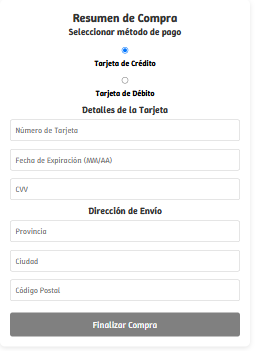

- Una vez completados los datos, se habilita el botón de finalizar compra. 

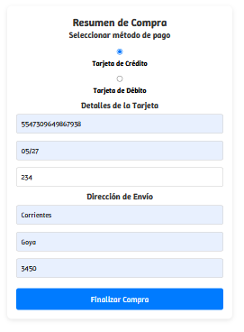

- Compra realizada con exito

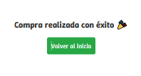

## Productos sin stock

- Cuanto el contador de productos llega a 0, pasa a estar Fuera de Stock. 

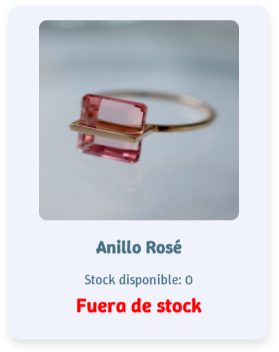

## Footer

- Seleccionando el nombre del negodio, podemos llegar al instagram del mismo.

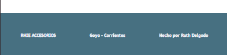

## Autora
- ** RUTH DELGADO **

## 📬 Contacto
Si tienes alguna pregunta o sugerencia, no dudes en contactarme:

Email: rinesdelgo@gmail.com
